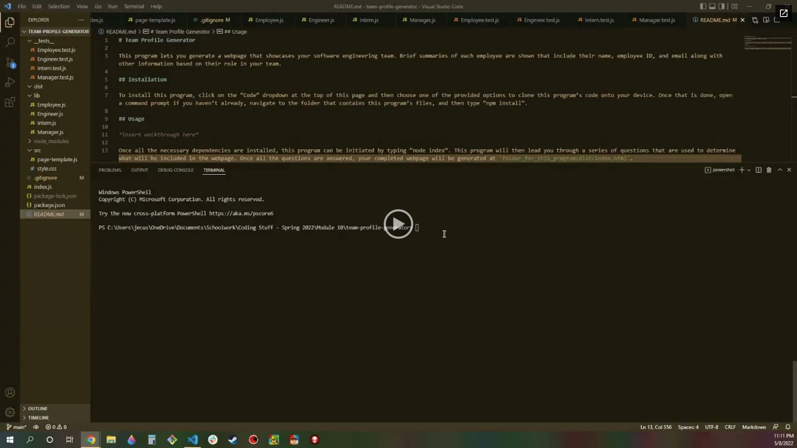

# Team Profile Generator

This program lets you generate a webpage that showcases your software engineering team. Brief summaries of each employee are shown that include their name, employee ID, and email along with other information based on their role in your team.

## Installation

To install this program, click on the “Code” dropdown at the top of this page and then choose one of the provided options to clone this program’s code onto your device. Once that is done, open a command prompt if you haven’t already, navigate to the folder that contains this program’s files, and then type “npm install”.

## Usage

Once all the necessary dependencies are installed, this program can be initiated by typing “node index”. This program will then lead you through a series of questions that are used to determine what will be included in the webpage. Once all the questions are answered, your completed webpage will be generated at `folder_for_this_program/dist/index.html`.

## Contributors

Made with ❤️ by JEC6789